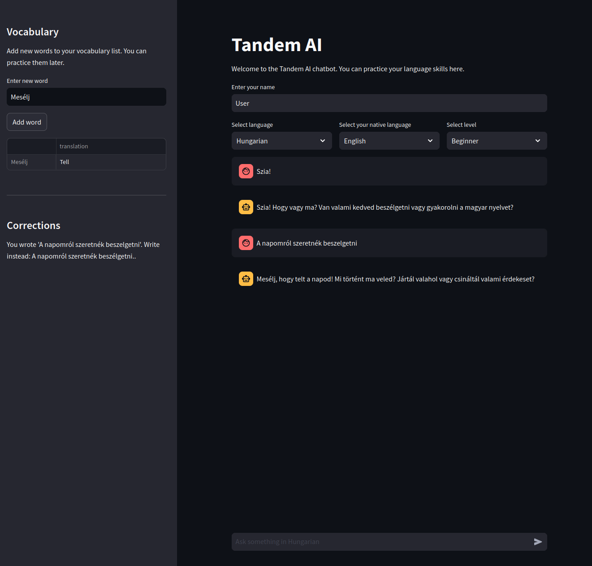

# Tandem AI
## Your virtual tandem partner

Learning languages is great, but many language apps often lack the conversational, everyday interactions that make you more confident in your language skills. While you have a chat in your language of choice, an invisible critic is providing corrections to make sure you catch your mistakes.



## Features

- **Conversational Practice**: Engage in real-life conversations to improve your fluency.
- **Instant Feedback**: Get immediate corrections and suggestions.
- **Multiple Languages**: Practice with a variety of languages.

## Installation

1. Clone the repository:
    ```bash
    git clone https://github.com/yourusername/tandemAI.git
    ```
2. Navigate to the project directory:
    ```bash
    cd tandemAI
    ```
3. Install the required dependencies:
    ```bash
    pip install -r requirements.txt
    ```

## Usage

1. Run the application:
    ```bash
    streamlit run main.py
    ```
2. Your browser will open automatically. If not, navigate to the localhost address shown in the terminal.

